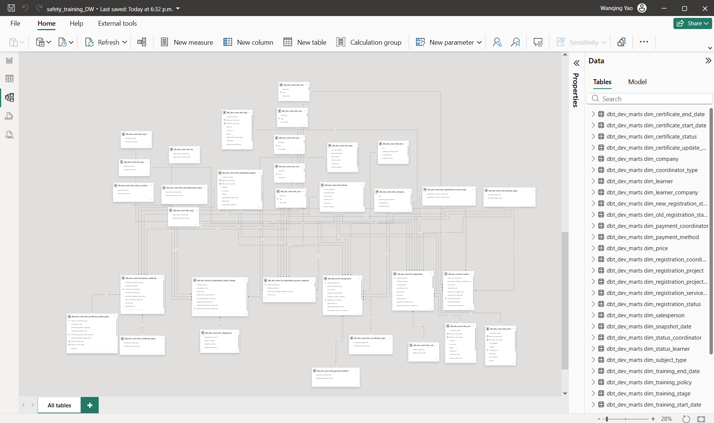

# Safety Training Analytics Warehouse

A PostgreSQL/dbt dimensional warehouse integrating six safety-training source tables for registration, collections, training progress, and certificate-expiration analysis. Includes a tested Docker demo with fictional data; Power BI reporting is developed separately.

**Stack:** PostgreSQL 16 · dbt-core 1.12.4 · dbt-postgres 1.11.0 · Docker Compose · Power BI

**Validation:** 33 models and 10 seeds built successfully; all 405 data tests passed in both local PostgreSQL and Docker runs.

## Dimensional modeling highlights

- **Explicit fact grains:** separate registration, payment, training, and certificate records to avoid double counting.
- **Conformed and role-playing dimensions:** support cross-process analysis while distinguishing learner/settlement companies and date roles.
- **Events and accumulating snapshot:** combine inferred status transitions with current registration, training, and collection progress.
- **Effective-dated matching and quality checks:** match prices and policies by validity period, handle Unknown/Not Applicable members, and validate the model with 405 data tests.

## Quick start

With Docker Desktop running, execute:

```sh
git clone https://github.com/caroly0216/safety-training-analytics.git
cd safety-training-analytics
docker compose up -d db
docker compose run --build --rm dbt
```

Expected: `PASS=448 WARN=0 ERROR=0 SKIP=0`. No private database is needed. The public demo includes 13 fictional registrations; no PBIX is distributed. See below for connection settings, model grains, and limitations.

## Power BI Model Preview

The private report's semantic model uses shared dimensions and role-playing date/company tables. This screenshot shows model structure, not business records; Power BI role copies increase the displayed table count beyond the warehouse's 17 dimensions.



## Model

- **Staging:** source-specific cleaning and consistent column names.
- **Intermediate:** registration standardization, classification, and enrichment.
- **Marts:** 17 dimensions and six facts covering registration, payment, training execution, learner certificates, registration status changes, and a registration process snapshot.
- **Quality checks:** schema tests and custom reconciliation tests for price versions and registration collection status.

The model separates agreed charges, market list prices, and collected amounts. Certificate expiration reporting uses the certificate end-date role of the date dimension; unknown expiration dates are not treated as expired.

| Fact table | Grain / purpose |
| --- | --- |
| `fct_registration` | One source registration record; classification, agreed amount, collection status, and market-price reference |
| `fct_payment` | One collected registration record; not a bank transaction ledger |
| `fct_training_execution` | One registration's training record, including missing-date cases |
| `fct_learner_certificate` | One source registration with certificate information; not necessarily one unique current certificate |
| `fct_registration_status_change` | An inferred status transition between ordered registrations for the same learner and mapped project |
| `fct_registration_process_snapshot` | One registration's current registration, training, and collection progress |

## Repository scope

This is a runnable synthetic-data demo. Real learner records, business workbooks, database credentials, the Power BI data model, and original Git history are excluded. All demo people, companies, identifiers, prices, and policy rules are fictional; policy examples are not regulatory advice.

The salesperson row in this copy is an example placeholder. Dashboard screenshots, if added later, must use anonymized data.

## Structure

```text
models/staging/       Source transformations
models/intermediate/  Conformed registration logic
models/marts/         Dimensions and facts
tests/               Custom data-quality assertions
analyses/            Profiling queries
```

## Run with Docker

Use the Quick start commands above. If you already cloned the repository, run only the two `docker compose` commands from its directory.

First startup creates six raw tables and loads synthetic records. `dbt build` loads ten mapping seeds, builds models, and runs tests. Internet access is needed for first-time image/dependency downloads; port 55432 must be available.

```sh
docker compose exec db psql -U demo -d safety_training_demo -c "select collection_status, count(*), sum(agreed_amount) from dbt_demo_marts.fct_registration group by collection_status;"
```

`docker compose down` stops the demo and preserves data. `docker compose down -v` deletes this project's demo database volume: use it only when intentionally resetting the demo. Initialization SQL runs only with an empty volume.

## Expected results

| Check | Expected |
| --- | ---: |
| Registrations | 13 |
| Payment records | 7 |
| Collected amount | 3,950 |
| Uncollected agreed amount | 2,880 |
| Certificate records | 7 |
| Registration status changes | 1 |

Fixtures cover personal/company registrations, paid/unpaid amounts, cancellation followed by normal registration, and known/unknown certificate dates. Certificate fixtures use dates relative to initialization; expiry counts change over time. Update the demo-specific assertion if changing fixtures.

## Power BI 

The private Power BI report includes an overview, collection details, certificate information, process control, and learner information. The semantic model uses shared dimensions and role-playing dates/companies. Report visuals and metric labels are still being refined; the report is not presented as fully signed off. This repository currently provides the runnable warehouse, not a downloadable Power BI report or scheduled notification service.

PostgreSQL Import connection: `localhost:55432`, database `safety_training_demo`, user `demo`, password `demo_password`. These are public local-demo credentials, not production credentials. The database port binds only to localhost. Load dimensions and facts from `dbt_demo_marts`, with one-to-many, single-direction dimension-to-fact relationships. Dates and companies have multiple roles requiring role-specific relationships or copies. No private PBIX is included.

## Without Docker

Use an empty, dedicated PostgreSQL database, never your production database.

1. Create a Python virtual environment; install `demo/requirements.txt`.
2. Load `demo/raw_schema.sql`, then `demo/fixtures.sql`, using `psql -v ON_ERROR_STOP=1 -d YOUR_DEMO_DATABASE -f FILE` with your connection settings.
3. Set environment variables `DBT_DEMO_HOST`, `DBT_DEMO_PORT`, `DBT_DEMO_USER`, `DBT_DEMO_PASSWORD`, and `DBT_DEMO_DATABASE`.
4. Run `dbt build --profiles-dir demo` from this directory.

`demo/queries.sql` contains inspection queries. `demo/generate_samples.py` regenerates fictional mapping seeds without reading private records.

The accumulating snapshot is a current-state table, not historical dbt snapshots. Date-dependent table attributes refresh when dbt runs.

## Scope and limitations

- The demo contains 13 fictional registration records designed to exercise business rules, not to demonstrate large-scale performance.
- Source ingestion is represented by SQL fixtures; private spreadsheet inputs and ingestion tooling are not shipped here.
- Status changes are inferred from source ordering, not captured from an authoritative audit log.
- Certificate records can have unknown numbers or inferred expiry dates. Follow-up lists require business review before contacting learners.
- Certificate-expiration analysis is implemented; automated messages, production scheduling, and a historical change-data-capture pipeline are outside this demo's scope.

## Verified build

Validated on 2026-09-27 both in a separate local PostgreSQL 16 database and through the Docker Compose workflow using dbt-core 1.12.4 and dbt-postgres 1.11.0. Both builds completed with PASS=448, WARN=0, ERROR=0, SKIP=0: 33 models, 10 seeds, and 405 data tests. The Docker result was confirmed from the user's completed run.
